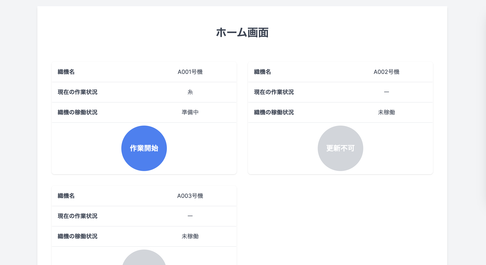
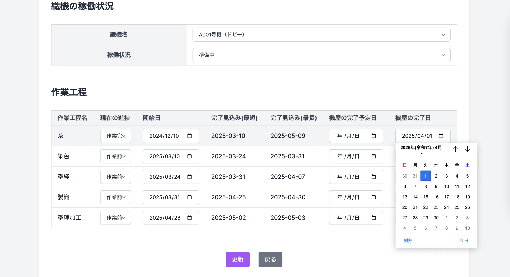

# LooMa（ルーマ）

## アプリケーション概要

**LooMa（ルーマ）** は、織物製造業の生産管理を効率的に行うWebアプリケーションです。シンプルなボタン操作により、問屋（管理者）は複数の機屋の稼働状況を可視化し、また、機屋（一般ユーザ）は自社の稼働状況を可視化することで、発注から納品までの工程を一括管理することができます。

### 解決する課題

山梨県富士吉田の織物産業における以下の3つの主要課題を解決します：

1. **納期の不透明さ**：原料の入荷時期が不透明で、発注者が納期を正確に把握できない
2. **機屋の稼働状況把握の困難さ**：複数の機屋（合計8社）の稼働状況をリアルタイムで把握することが難しい
3. **管理体制の煩雑化**：属人的なメモによる管理が多く、情報が整理されていない

### コンセプト

- **一括管理**：複数の機屋の情報を一画面で管理
- **ボタン操作の簡単さ**：IT知識がなくても直感的に操作可能
- **可視化**：稼働状況や納期を視覚的に確認可能

## 主要機能(管理者)

### 1. 稼働状況の一括管理


- エルトップ様と取引のある8社分の織機の稼働状況を1画面で把握
- 未稼働/準備中/稼働中/故障中の状態を色分けで視覚化

### 2. 納期の可視化

### ガントチャートで最新の納期状況を表示


- 一覧画面・詳細画面、ガントチャートから予定納期を把握
- 各工程（糸入荷、整経、製織、整理加工等）のステータスと進捗を視覚化

## 主要機能(管理者/機屋)

### 1. シンプルなステータス管理

### ５つの作業工程の進捗を同じ画面で更新


- ボタン1つの操作で作業状態を更新
- 普段アプリを使用しない方でも簡単に操作可能

### 機屋(一般ユーザ)ホーム画面

### 1. シンプルなステータス管理

### 1個のボタンで織機の稼働状況を更新



- ボタン1つの操作で作業状態を更新
- 普段アプリを使用しない方でも簡単に操作可能

## 基本操作の流れ

### 1. 発注(管理者)


### 2. 機械の割り当て(管理/機屋で操作可能)

#### 発注一覧の編集ボタンを押す


#### 機械を選択して割り当てる


### 3. 各工程(糸〜整理加工)の進捗を更新(管理/機屋で操作可能)

#### 発注一覧の編集ボタンを押す


### ①糸工程の完了日を入力

### ②「現在の進捗」の選択項目を「作業完了」に変更



### 4. ガントチャートで最新の納期に反映されていることを確認(管理者)


### 5. (機屋)

### 1個のボタンで作業工程、織機の稼働状況を更新

### ①ボタンを一回押す：糸〜整型までの工程を「作業完了」に変更

### ②ボタンを一回押す：製織工程を「作業完了」に変更


## 使用技術

### バックエンド

- Ruby 3.3.7
- Rails 7.2.2
- PostgreSQL (データベース)

### フロントエンド

- Tailwind CSS (UIデザイン)
- Frappe Gantt (ガントチャート表示)
- React (発注フォム入力値をリアルタイムでエラー表示)

### AWS（本番環境インフラ）

設定内容の詳細は以下のとおりです。

- **EC2 インスタンス(仮想サーバOS：Amazon Linux 2023)**
- **ElasticIPの取得、割り当て**

- **セキュリティグループの設定**

- **Route 53(ドメイン管理)**

- **Let's Encrypt（Certbot、SSL証明書発行）**

- **AWS CLIでNginxの設定**

- **AWS CLIでPumaの設定**
- **Amazon EventBridge(自動起動)**

### アクセス方法

※ アクセス可能時間 9:00~21:00

```
https://looma.jp
```

## デモアカウント

① 問屋（管理者）

```
メールアドレス: aaa@example.com
パスワード: password
```

② 機屋A（一般ユーザ）

```
メールアドレス: bbb@example.com
パスワード: password
```

## 工夫した点

### アプリの設計について

- 現場訪問を通じて実際の業務内容や課題を理解し、解決策を絞り込み
- オンラインMTGや週次進捗報告など、クライアントとの密なコミュニケーション
- ユーザーの技術リテラシーを考慮した、シンプルで直感的なUI設計

### チーム開発について

- 同時並行での開発における連携と動作確認の徹底
- 毎朝15分の進捗報告など、開発メンバー間の密なコミュニケーション
- 小さな機能単位でのテストと統合を繰り返すアジャイル的アプローチ

## 開発チーム

**WEF2409**

- 高野 里美（ディープロ2024年9月期生）：山口県出身、山口大学大学院細胞生理学専攻、前職はインフラエンジニア
- 荻野 大暉（ディープロ2024年9月期生）：兵庫県出身、東京理科大学理工学部卒、前職はSEOコンサルティング

## 謝辞

本プロジェクトは「地域課題解決ハッカソン」の一環として実施されました。以下の皆様に感謝申し上げます：

- 株式会社エルトップ様（課題提供・現場見学受け入れ）
- キャップクラウド様、株式会社リンクレア様（ハッカソン運営）
- メンターの宮岡様

## ER図


### データベース構成（ER図の補足説明）

生産管理に必要な情報を以下のテーブルで管理しています。

| テーブル名            | 役割                                     | 関連テーブル                         |
| --------------------- | ---------------------------------------- | ------------------------------------ |
| `companies`           | 会社情報を管理                           | `machines`, `orders` など            |
| `machines`            | 会社の機械情報(織機の種類、番号)を管理   | `companies`, `productions` など      |
| `orders`              | 問屋(管理者)からの発注情報を管理         | `companies`, `productions` など      |
| `Work_processes`      | 生産進捗・ステータスを管理(1発注に5工程) | `orders`, `Work_process_status` など |
| `Machine_assignments` | 発注に割り当てられる織機を管理           | `machines`, `Work_processes`         |

- 各テーブルは 1対多 や 多対1 の関係を持ち、業務上の流れ（発注→生産→完了）に沿って構築しています。
- ER図内の矢印はリレーションの方向と一対多の関係を示しています。

## 付属資料


アプリに関する詳細説明は下記をご参照ください

https://www.canva.com/design/DAGV0WAuMqg/TigRgRj8cPy0KLoFw7Wpow/edit

